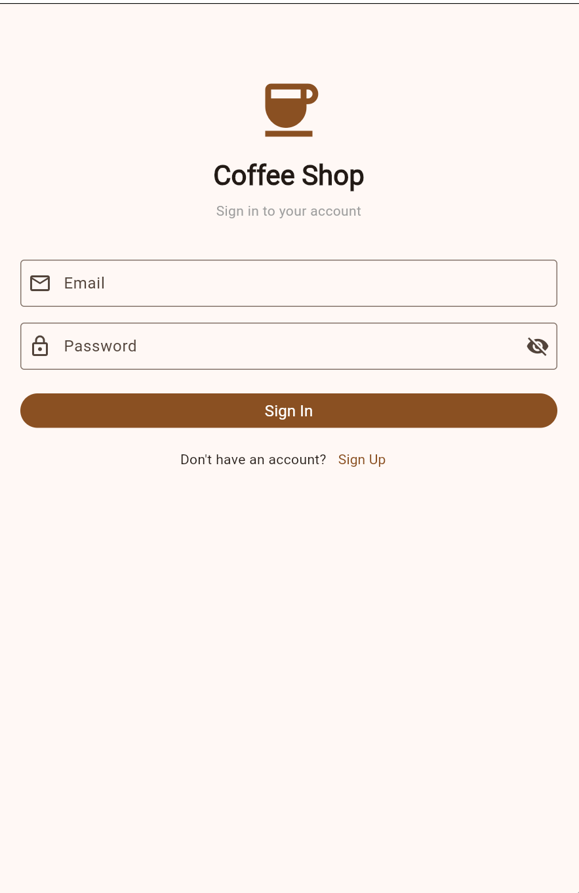
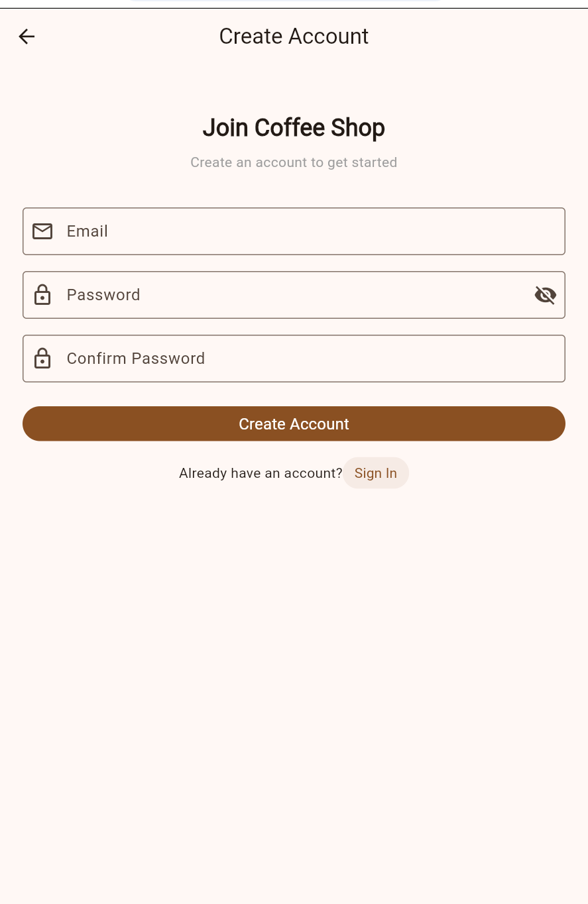
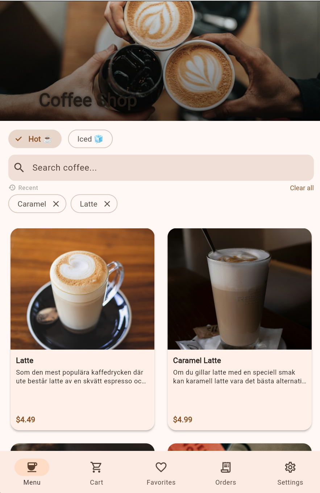
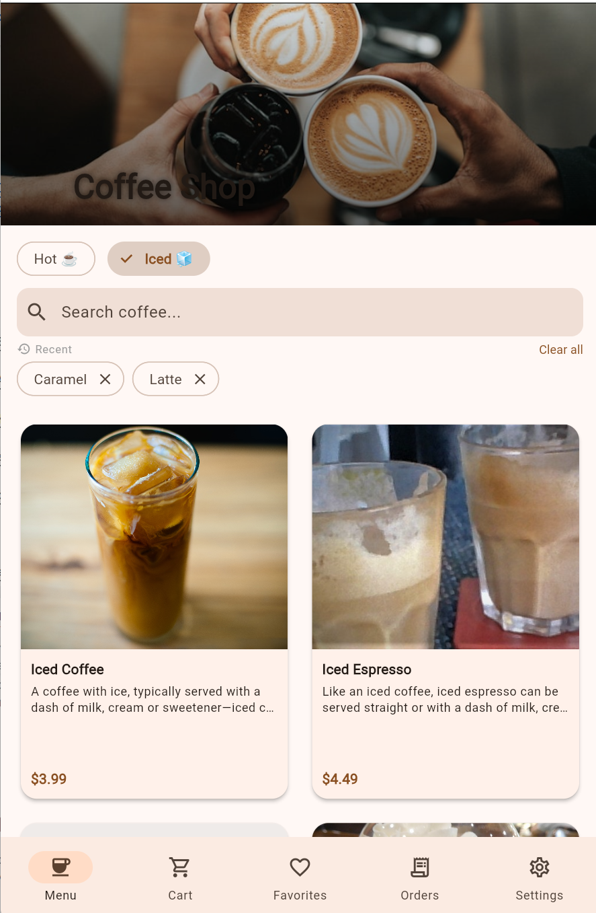
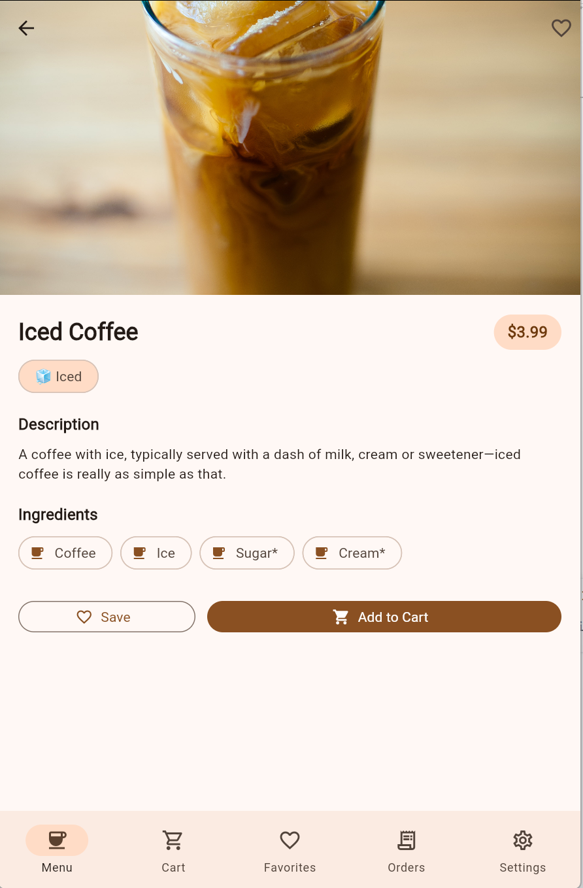
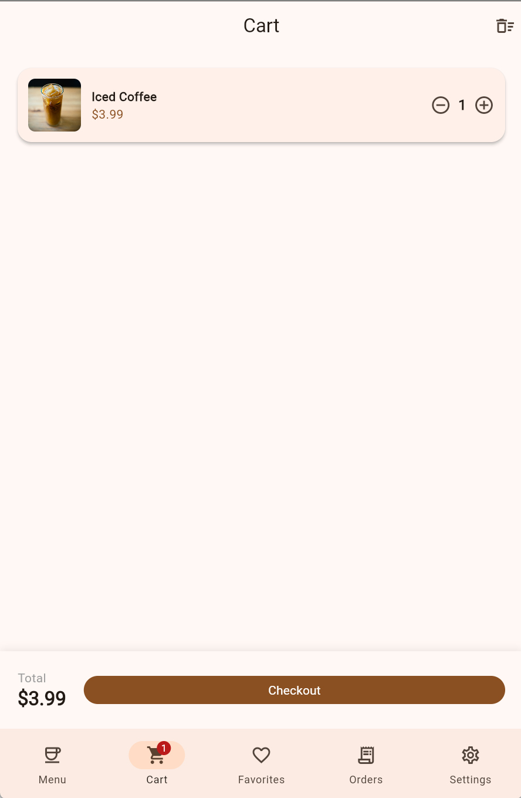
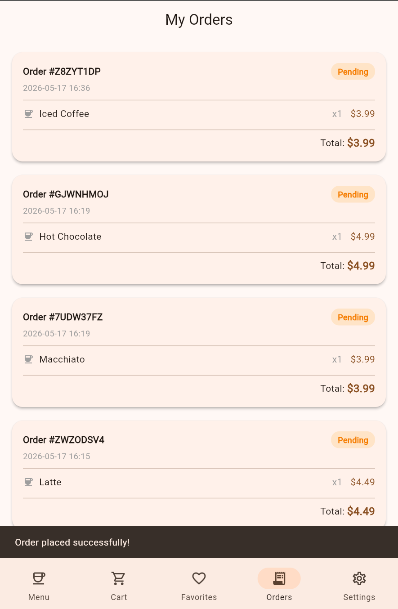
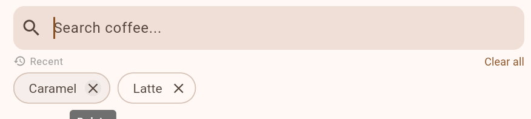
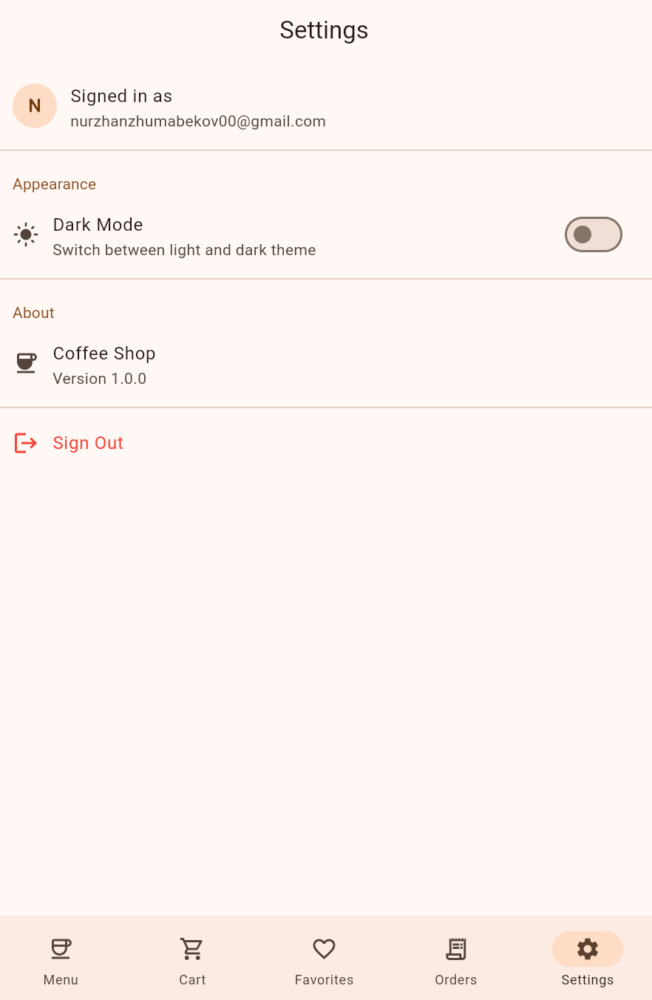

# Coffee Shop — Flutter Final Project

A coffee shop mobile and web application built with Flutter. Users can browse the menu, add items to the cart, save favorites, place orders, and view their order history through Firebase.

---

## Team

**Nurzhan Zhumabekov** (Nurzhan.D.Zhumabekov)
1. Project architecture (Clean Architecture)
2. REST API integration with Chopper
3. Navigation setup with go_router
4. Menu screen and product detail screen

**Nurassyl Nygmet** (NurasylAitu)
1. Light and dark theme toggle persisted with SharedPreferences
2. Favorites screen with local storage using Drift (SQLite)
3. Cart screen
4. Menu search with saved search history

**Nurbek Yerbulekov** (Bornqazaq)
1. Firebase Authentication (email and password sign in and registration)
2. Cloud Firestore for saving and displaying order history
3. Orders screen
4. Settings screen with account info and sign out

---

## Features

1. Browse hot and iced coffee menu loaded from a public REST API
2. Product detail page with description, price, and image
3. Add items to cart, change quantities, and place an order
4. Save favorite items locally, they persist between sessions
5. Search history is saved and shown as chips below the search bar
6. Register and sign in with email and password via Firebase
7. Order history is stored in the cloud with Firestore
8. Switch between light and dark theme, preference is saved

---

## Technologies used

1. Flutter 3.41.5 and Dart 3.11.3
2. Riverpod for state management
3. go_router for navigation with auth redirect guard
4. Chopper as the HTTP client for the REST API
5. json_serializable for JSON model generation
6. Drift with SQLite for local favorites storage
7. Shared Preferences for theme and search history
8. Firebase Auth for email and password authentication
9. Cloud Firestore for cloud order storage

---

## Architecture

The project follows Clean Architecture and is split into three layers:

1. domain — entities like Product and AppOrder, and repository interfaces
2. data — models, Chopper service, Drift database, repository implementations
3. presentation — Riverpod providers, screens, router, and widgets

---

## Getting started

1. Clone the repository and navigate into the folder
2. Run `flutter pub get`
3. Make sure `firebase_options.dart` is present, or run `flutterfire configure`
4. In Firebase Console enable Authentication with Email/Password and create a Firestore Database
5. Run `flutter run -d chrome` for web or `flutter run -d android` for Android

---

## API

Product data is fetched from the public sampleapis.com service:

1. Hot coffees: `https://api.sampleapis.com/coffee/hot`
2. Iced coffees: `https://api.sampleapis.com/coffee/iced`

---

## Screenshots

Login screen

Register screen

Menu — hot drinks

Menu — iced drinks

Product detail

Cart

Order history

Search with history

Settings

---

## Demo video

https://www.youtube.com/watch?v=OuVGdfvTE2k
